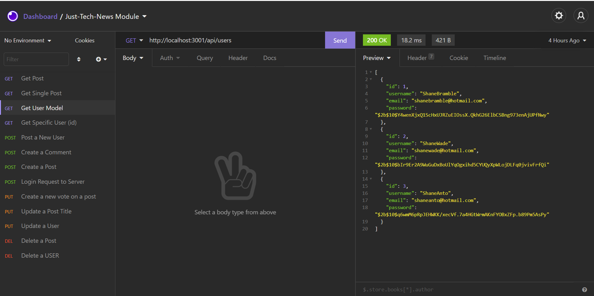
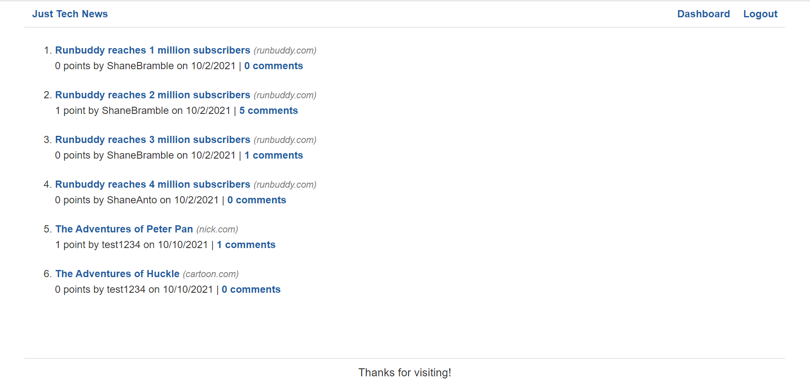

# Just-Tech-News

# Description

In this module, I built the back end for my first completely full-stack application. Just Tech News—a tech news is a website where users can post, upvote, and comment on links to news articles. I used used Sequelize, an object-relational mapping (ORM) library, to simplify my MySQL queries, add password hashing so that users can create secure passwords, and connected my application to JawsDB, a MySQL add-on for Heroku.




# Pre-requisites

- Install [Node.js](https://nodejs.org/en/) version 8.0.0

# Getting started

- Clone the repository

```
git clone <git@github.com:shanebramble/just-tech-news.git> 
```

- Install dependencies

```
cd <project_name>
npm install
```

- Build and run the project

```
npm start
```

### Built With

- JavaScipt
- Node.js
- MySQL
- Sequelize (NPM Package)

## Contribution

Made with ❤️ by Shane Bramble-Wade

### ©️2021 Just-Tech-News, Inc